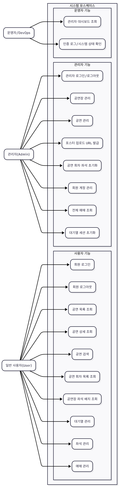
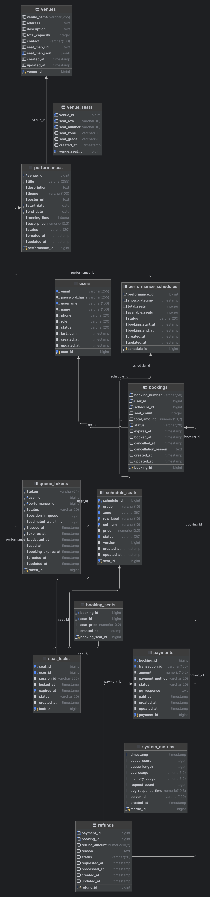

# 문화 공연 티켓팅 서비스 Tigetting

## 프로젝트 기간
- (기간: 2025-11-14 ~ 2025-12-20)
## 공연 티켓팅 웹 서비스 WBS

| WBS-Code | 작업명                                             | 기간(일) | 완료율(%) | 담당자         | 선행작업  |
|----------|----------------------------------------------------|---------:|---------:|---------------|-----------|
| 1        | 프로젝트 기획 및 분석                              | 5        | 80%      | 정성원/안도형 | -         |
| 1.1      | OpenAPI(API 명세) 분석                             | 2        | 90%      | 정성원        | 1         |
| 1.2      | 요구사항 정의 (유스케이스, 유저 시나리오)         | 2        | 50%      | 안도형        | 1.1       |
| 1.3      | 화면 정의서 / 와이어프레임 작성                    | 3        | 0%       | 정성원        | 1.2       |
| 2        | 시스템 설계                                        | 7        | 0%       | 안도형        | 1         |
| 2.1      | DB/ERD 설계 (MySQL, 좌석/대기열/예매 구조)        | 3        | 0%       | 안도형        | 1.2       |
| 2.2      | 백엔드 아키텍처 설계 (Spring MVC, 계층 구조, 패키지) | 4      | 0%       | 안도형        | 2.1       |
| 2.3      | 프론트엔드 아키텍처 설계 (Vue 라우팅, 상태관리)   | 3        | 0%       | 정성원        | 1.3       |
| 3        | 개발 환경 & 인프라 세팅                            | 8        | 0%       | 정성원/안도형 | 1         |
| 3.1      | Git/Gradle/Vue 기본 프로젝트 생성                  | 2        | 0%       | 정성원/안도형 | 2.2,2.3   |
| 3.2      | Docker Compose 초안 (backend, frontend, mysql)     | 3        | 0%       | 정성원/안도형 | 3.1       |
| 4        | 백엔드 구현 (Spring Boot + MyBatis)                | 11       | 0%       | 안도형        | 2.2,3.1   |
| 4.1      | 인증/인가(JWT) 및 사용자/관리자 로그인 API        | 4        | 0%       | 정성원        | 2.2       |
| 4.2      | 공연장/공연/회차 API 구현                          | 4        | 0%       | 안도형        | 4.1       |
| 4.3      | 대기열/좌석/예매 API 구현                          | 7        | 0%       | 안도형        | 4.2       |
| 4.4      | Swagger(OpenAPI) 문서 정리                         | 3        | 0%       | 안도형        | 4.3       |
| 5        | 프론트엔드 구현 (Vue + UI 라이브러리)              | 10       | 0%       | 정성원        | 2.3,3.1   |
| 5.1      | 공통 레이아웃/라우팅 구현                          | 3        | 0%       | 정성원        | 2.3       |
| 5.2      | 사용자 플로우 화면 (공연 목록→좌석 선택→예매)     | 7        | 0%       | 정성원        | 5.1,4.2   |
| 5.3      | 관리자(Admin) 화면 (공연/회원/예매/대시보드)      | 4        | 0%       | 정성원        | 5.2,4.3   |
| 6        | 통합, 테스트, 배포                                 | 11       | 0%       | 정성원/안도형 | 4,5       |
| 6.1      | 프론트-백엔드 API 연동 및 통합 테스트              | 7        | 0%       | 정성원/안도형 | 4,5       |
| 6.2      | Docker Compose 환경에서 통합 실행                  | 7        | 0%       | 정성원/안도형 | 3.2,6.1   |
| 6.3      | 버그 수정 및 성능 튜닝                            | 5        | 0%       | 정성원/안도형 | 6.1       |
| 7        | 문서화 및 발표 준비                                | 5        | 0%       | 정성원        | 6         |
| 7.1      | 사용자/관리자 매뉴얼, 실행 가이드 작성             | 4        | 0%       | 정성원/안도형 | 6         |
| 7.2      | 최종 발표자료 및 시연 시나리오 작성                | 3        | 0%       | 정성원        | 7.1       |

## 공연 티켓팅 웹 서비스 간트차트 일정  
[간트차트] (https://ahndohyung.atlassian.net/jira/software/projects/KAN/boards/1/timeline)

| WBS-Code | 작업명                                             | 시작일     | 종료일     | 기간(일) |
|----------|----------------------------------------------------|------------|------------|---------:|
| 1        | 프로젝트 기획 및 분석                              | 2025-11-14 | 2025-11-20 | 7 |
| 1.1      | OpenAPI(API 명세) 분석                             | 2025-11-14 | 2025-11-15 | 2 |
| 1.2      | 요구사항 정의 (유스케이스, 유저 시나리오)         | 2025-11-16 | 2025-11-17 | 2 |
| 1.3      | 화면 정의서 / 와이어프레임 작성                    | 2025-11-18 | 2025-11-20 | 3 |
| 2        | 시스템 설계                                        | 2025-11-18 | 2025-11-24 | 7 |
| 2.1      | DB/ERD 설계 (MySQL, 좌석/대기열/예매 구조)        | 2025-11-18 | 2025-11-20 | 3 |
| 2.2      | 백엔드 아키텍처 설계 (Spring MVC, 계층 구조, 패키지) | 2025-11-21 | 2025-11-24 | 4 |
| 2.3      | 프론트엔드 아키텍처 설계 (Vue 라우팅, 상태관리)   | 2025-11-21 | 2025-11-23 | 3 |
| 3        | 개발 환경 & 인프라 세팅                            | 2025-11-25 | 2025-11-29 | 5 |
| 3.1      | Git/Gradle/Vue 기본 프로젝트 생성                  | 2025-11-25 | 2025-11-26 | 2 |
| 3.2      | Docker Compose 초안 (backend, frontend, mysql)     | 2025-11-27 | 2025-11-29 | 3 |
| 4        | 백엔드 구현 (Spring Boot + MyBatis)                | 2025-11-25 | 2025-12-12 | 18 |
| 4.1      | 인증/인가(JWT) 및 사용자/관리자 로그인 API        | 2025-11-25 | 2025-11-28 | 4 |
| 4.2      | 공연장/공연/회차 API 구현                          | 2025-11-29 | 2025-12-02 | 4 |
| 4.3      | 대기열/좌석/예매 API 구현                          | 2025-12-03 | 2025-12-09 | 7 |
| 4.4      | Swagger(OpenAPI) 문서 정리                         | 2025-12-10 | 2025-12-12 | 3 |
| 5        | 프론트엔드 구현 (Vue + UI 라이브러리)              | 2025-11-24 | 2025-12-13 | 20 |
| 5.1      | 공통 레이아웃/라우팅 구현                          | 2025-11-24 | 2025-11-26 | 3 |
| 5.2      | 사용자 플로우 화면 (공연 목록→좌석 선택→예매)     | 2025-12-03 | 2025-12-09 | 7 |
| 5.3      | 관리자(Admin) 화면 (공연/회원/예매/대시보드)      | 2025-12-10 | 2025-12-13 | 4 |
| 6        | 통합, 테스트, 배포                                 | 2025-12-14 | 2025-12-20 | 7 |
| 6.1      | 프론트-백엔드 API 연동 및 통합 테스트              | 2025-12-14 | 2025-12-20 | 7 |
| 6.2      | Docker Compose 환경에서 통합 실행                  | 2025-12-14 | 2025-12-20 | 7 |
| 6.3      | 버그 수정 및 성능 튜닝                            | 2025-12-16 | 2025-12-20 | 5 |
| 7        | 문서화 및 발표 준비                                | 2025-12-16

## 유스케이스 다이어그램

## ERD

## API 명세서
[API](https://www.notion.so/SSAFY-ticketing-29ce421455b380979e27c36143cc9903?source=copy_link)

